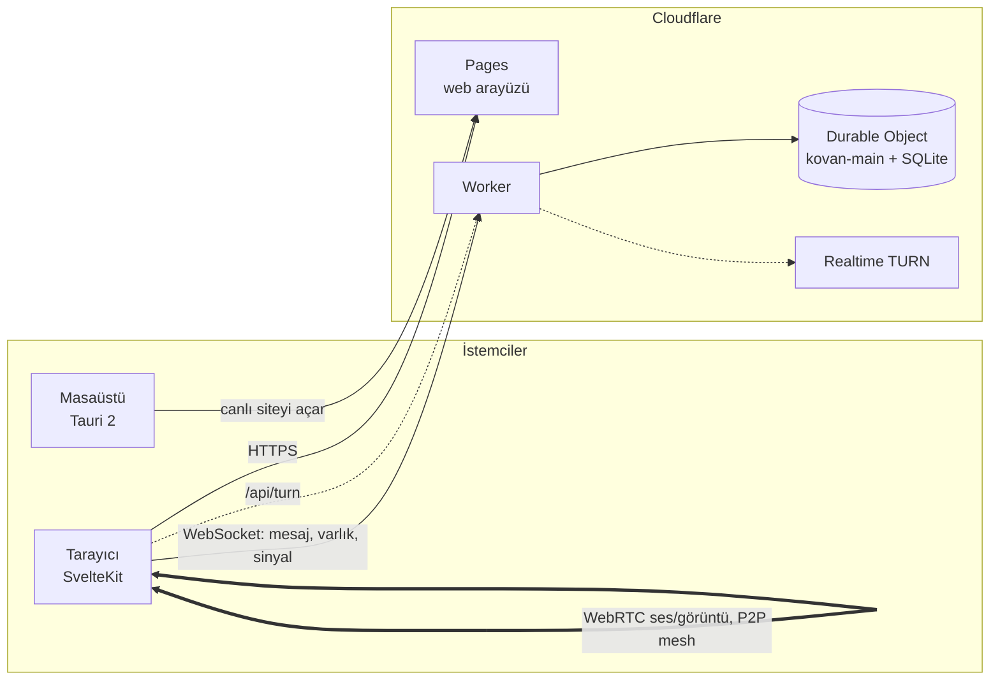

# Kovan

Küçük bir arkadaş grubu için tek sunuculu, Discord benzeri sesli ve görüntülü
sohbet. Metin kanalı, ses kanalı, kamera, ekran paylaşımı ve Windows
masaüstü uygulaması.

Kovan her gün kullanılıyor, ama büyümek için tasarlanmadı: **tek sunucu, en
fazla dört kişilik ses odası, davetle üyelik.** Bu sınırlar bilinçli; altyapı
maliyetini sıfıra yakın ve sistemi tek kişinin kavrayabileceği boyutta
tutuyorlar.

## Özellikler

**Metin**
- Tek metin kanalı: mesaj geçmişi, tepkiler, tıklanabilir linkler
- Davet koduyla kayıt, yönetici uçlarıyla üye yönetimi

**Ses ve görüntü**
- WebRTC P2P mesh ses odası: konuşma göstergesi, kişi bazlı ses seviyesi (%0-200)
- Kamera ve ekran paylaşımı (sistem sesiyle), çözünürlük/fps seçimi
- Mikrofon kapısı, giriş/çıkış cihazı seçimi, cihaz kopunca kurtarma
- Kopma sonrası otomatik yeniden bağlanma, TURN credential tazeleme
- Giriş/çıkış ve susturma için bildirim sesleri (ses dosyası yok, WebAudio ile üretiliyor)

**Masaüstü (Windows)**
- Global kısayollar: `F8` bas-konuş, `F9` mikrofon, `F10` kulaklık
- Tepsiye küçülme, tek örnek, ağ yoksa yerel hata sayfası
- Web'e yapılan her deploy masaüstüne anında yansır, uygulama canlı siteyi açar

## Mimari



- **Tek Durable Object.** Bütün durum (üyeler, mesajlar, ses odası) tek bir
  nesnede ve onun SQLite'ında. Eşzamanlılık sorunu tek iş parçacığıyla
  çözülüyor, ayrı veritabanı yok.
- **Medya sunucudan geçmez.** Ses ve görüntü eşler arasında doğrudan akar.
  Sunucu yalnızca sinyal taşır (offer/answer/ICE). NAT arkasındaki eşler için
  TURN rölesi var.
- **Mesh, SFU değil.** Herkes herkese gönderir. Dört kişide bu sorun değil,
  daha fazlasında bant genişliği patlar. Tavan bu yüzden dört.
- **Paylaşılan protokol.** İstemci ve sunucu mesaj tipleri `shared/protocol.ts`
  içinde tek yerde tanımlı.

## Depo yapısı

| Klasör | İçerik |
| --- | --- |
| `server/` | Cloudflare Worker + Durable Object (`KovanServer`): kimlik, mesajlar, ses odası, TURN |
| `web/` | SvelteKit arayüzü, Cloudflare Pages'e deploy edilir. WebRTC katmanı `src/lib/rtc/` |
| `desktop/` | Tauri 2 kabuğu, ayrıntı [`desktop/README.md`](desktop/README.md) |
| `shared/` | İstemci ve sunucunun ortak protokol tipleri |
| `spike/` | İlk Tauri denemesi, arşiv niteliğinde |

## Yerelde çalıştırma

Gereksinimler: Node.js, masaüstü için Rust ve
[Tauri önkoşulları](https://v2.tauri.app/start/prerequisites/).

```bash
# 1) Sunucu: 127.0.0.1:8787
cd server && npm install && npm run dev

# 2) Web: 127.0.0.1:5173
cd web && npm install
cp .env.example .env
npm run dev
```

Kayıt davet kodu istiyor. Yerelde `KOVAN_DEV` bayrağı açık olduğu için davet
kodu doğrudan üretilebilir:

```bash
curl -X POST http://127.0.0.1:8787/api/dev/invite -d '{"code":"DENEME-1"}'
```

Masaüstü uygulaması web dev sunucusunu kendisi başlatır:

```bash
cd desktop && npm install && npm run dev
```

## Test

```bash
cd server && npm test        # Vitest, Durable Object mantığı
cd web && npm test           # Vitest birim testleri
cd web && npm run dogrula    # svelte-check + test + build
cd web && npx playwright test   # uçtan uca, sunucu ve web'i kendisi kaldırır
```

WebRTC katmanının karar mantığı (mesh, politeness, yeniden bağlanma, cihaz
seçimi) DOM'dan ayrılmış saf modüllerde. Bu yüzden büyük kısmı tarayıcı
olmadan test edilebiliyor.

## Deploy

**Sunucu (Worker):**

```bash
cd server
npx wrangler secret put ADMIN_KEY
npx wrangler secret put TURN_KEY_ID          # Cloudflare Realtime TURN
npx wrangler secret put TURN_KEY_API_TOKEN
npm run deploy
```

**Web (Pages):**

```bash
cd web
npm run build
npx wrangler pages deploy .svelte-kit/cloudflare --project-name kovan-web --branch main
```

> `--branch main` şart. Bayraksız deploy üretim adresine değil, dala özel
> önizleme adresine gider.

Üretimde `PUBLIC_WS_URL` ve `PUBLIC_API_URL` Worker'ın adresini göstermeli.

## Maliyet

Workers, Durable Objects ve Pages ücretsiz katmanda kalıyor. Tek ücretli parça
**TURN**: akan GB başına ücretlendiriliyor, taban ücreti yok. Mesh'te herkes
herkesten aldığı için kamera ve ekran paylaşımı trafiği hızlı büyütür.
`/api/turn` yalnızca oturum açmış kullanıcıya credential verir.

## Lisans

[MIT](LICENSE)
